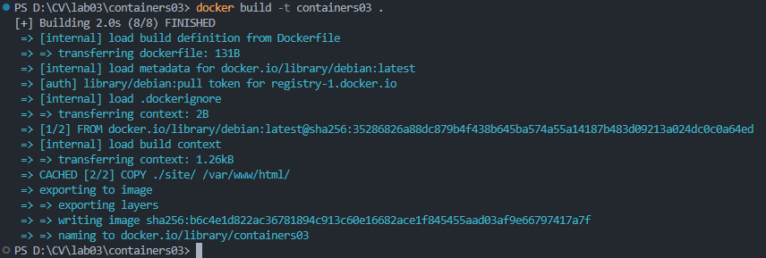
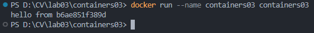
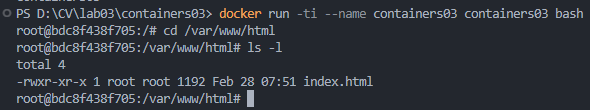

# Lucrarea de laborator nr. 3: Prima aplicație Docker

## Scopul lucrării
Această lucrare de laborator familiarizează cu elementele de bază ale containerizării și pregătește spațiul de lucru pentru următoarele lucrări de laborator.

## Sarcina
1. Instalarea `Docker Desktop` și verificarea funcționării acestuia.
2. Crearea și rularea unui container Docker pe baza unui fișier `Dockerfile`.
3. Testarea funcționalităților de bază ale containerelor Docker.

---

## Descrierea executării lucrării

### Pregătire

1. **Instalarea Docker Desktop**  
   * Am descărcat cea mai recentă versiune de [Docker Desktop](https://www.docker.com/products/docker-desktop/) și am instalat-o pe calculator.   

---

### Etape de execuție

#### 1. Crearea proiectului și clonarea unui repozitoriu
- Am creat reposzitoriul numit `containers03` pe GitHub.
- Am clonat repozitoriului pe computerul meu.

```
git clone git@github.com:trulyno/containers03.git
```

#### 2. Crearea Dockerfile
- În directorul `containers03`, am creat fișierul `Dockerfile` cu următorul conținut:

```Dockerfile
FROM debian:latest
COPY ./site/ /var/www/html/
CMD ["sh", "-c", "echo hello from $HOSTNAME"]
```

#### 3. Crearea directorului `site` și fișierului `index.html`
- Am creat un subdirector numit `site` în directorul `containers03` și, în interiorul acestuia, fișierul `index.html` cu conținut arbitrar.  

---

### Pornire și testare

#### 1. Construirea imaginii Docker
- În terminal, am rulat următoarea comandă pentru a construi imaginea containerului:

```bash
docker build -t containers03 .
```



Timpul de rulare al comenzii de creare a imaginii depinde de specificațiile hardware ale calculatorului și de conexiunea la internet. În cazul meu, timpul de execuție a fost de aproximativ *2 secunde*.

#### 2. Rularea containerului
- Am executat comanda pentru a porni containerul:

```bash
docker run --name containers03 containers03
```
 
În consola terminalului a fost afișat mesajul:  
`hello from [numele_random_al_containerului]` (unde `[numele_random_al_containerului]` reprezintă numele atribuit automat containerului).



#### 3. Ștergerea și redeschiderea containerului în mod interactiv
- Pentru a șterge containerul, am executat comanda:

```bash
docker rm containers03
```

- Am creat din nou containerul, rulând comanda în mod interactiv:

```bash
docker run -ti --name containers03 containers03 bash
```

- În interiorul containerului, am navigat la directorul `/var/www/html` și am listat fișierele disponibile:
  
```bash
cd /var/www/html/
ls -l
```



Pe ecran a fost afișat conținutul directorului `/var/www/html`, care include fișierul `index.html` copiat din directorul `site` în timpul construireii imaginii.

#### 4. Închiderea containerului
- Pentru a ieși din container, am utilizat comanda:

```bash
exit
```

---

## Concluzii
Acest laborator mi-a oferit o introducere practică în utilizarea Docker și în crearea containerelor. Am învățat:  
- Cum să instalez și să configurez Docker Desktop.  
- Să creez un fișier `Dockerfile` și să construiesc o imagine Docker pe baza acestuia.  
- Să rulez un container și să interacționez cu el în mod interactiv folosind terminalul.  
- Modul de a copia fișiere locale în interiorul unui container și de a verifica structura acestuia.  

Această lucrare de laborator formează bazele necesare pentru a avansa la lucrări mai complexe legate de containerizare.

---

## Bibliografie

1. Documentația Docker: [https://docs.docker.com/](https://docs.docker.com/).
2. Materialele de curs "Containerizarea și Virtualizarea" furnizate de lector.  